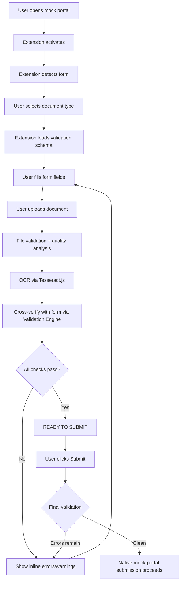
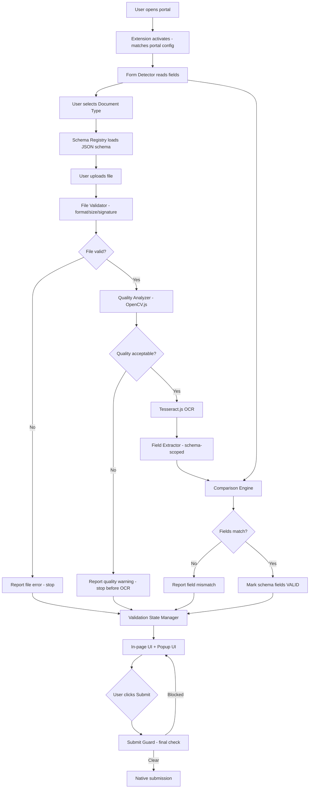
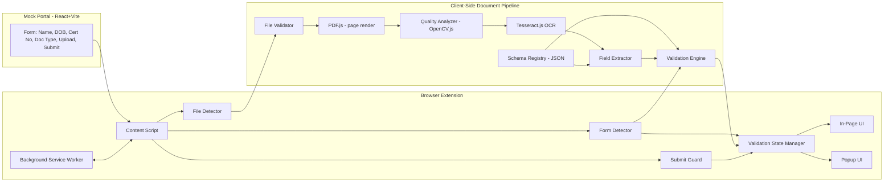
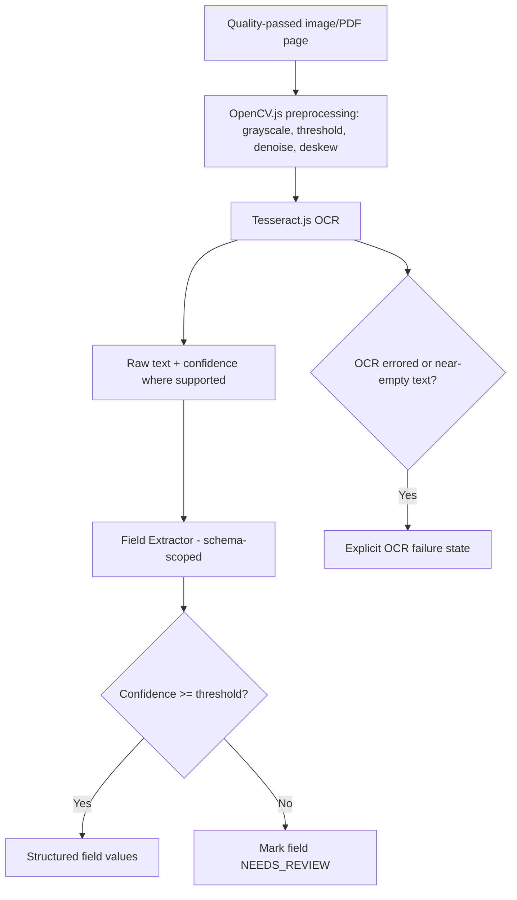
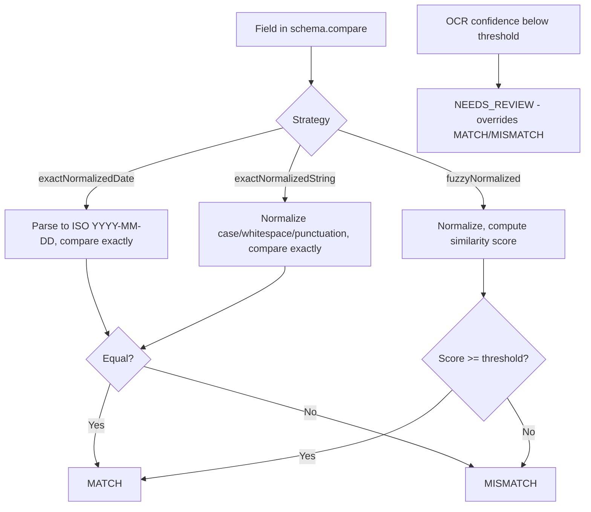
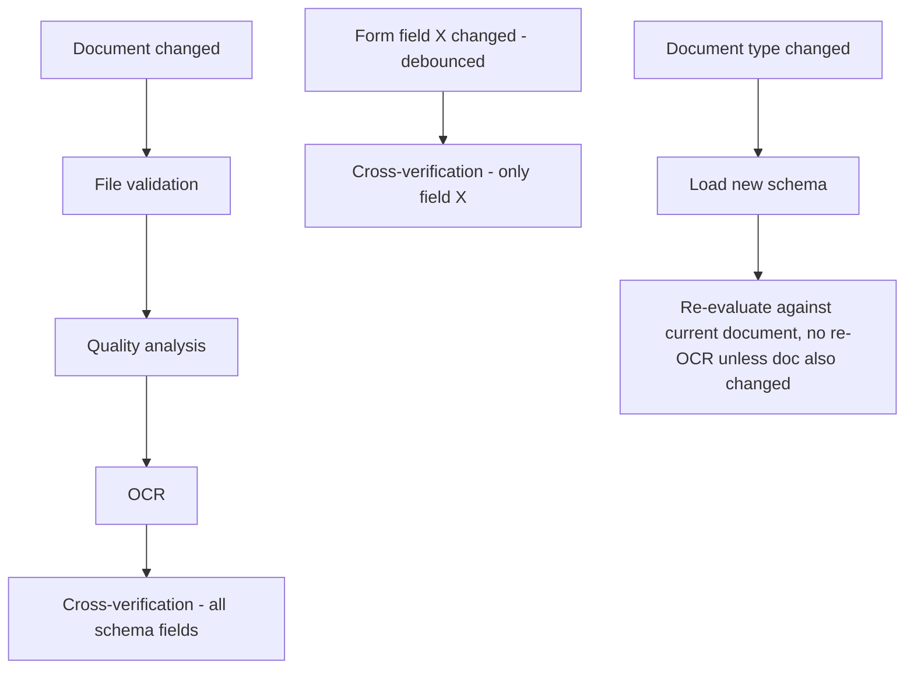
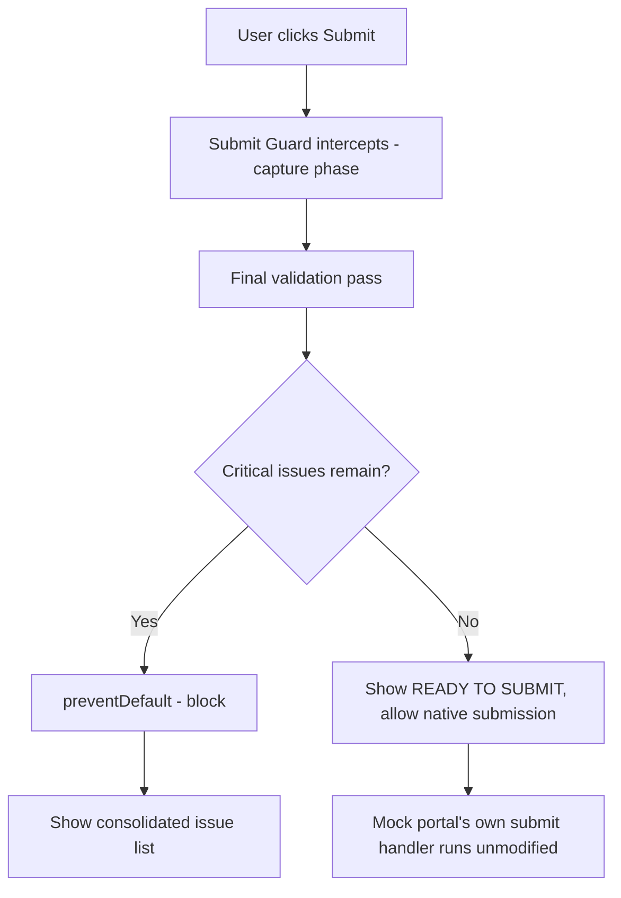
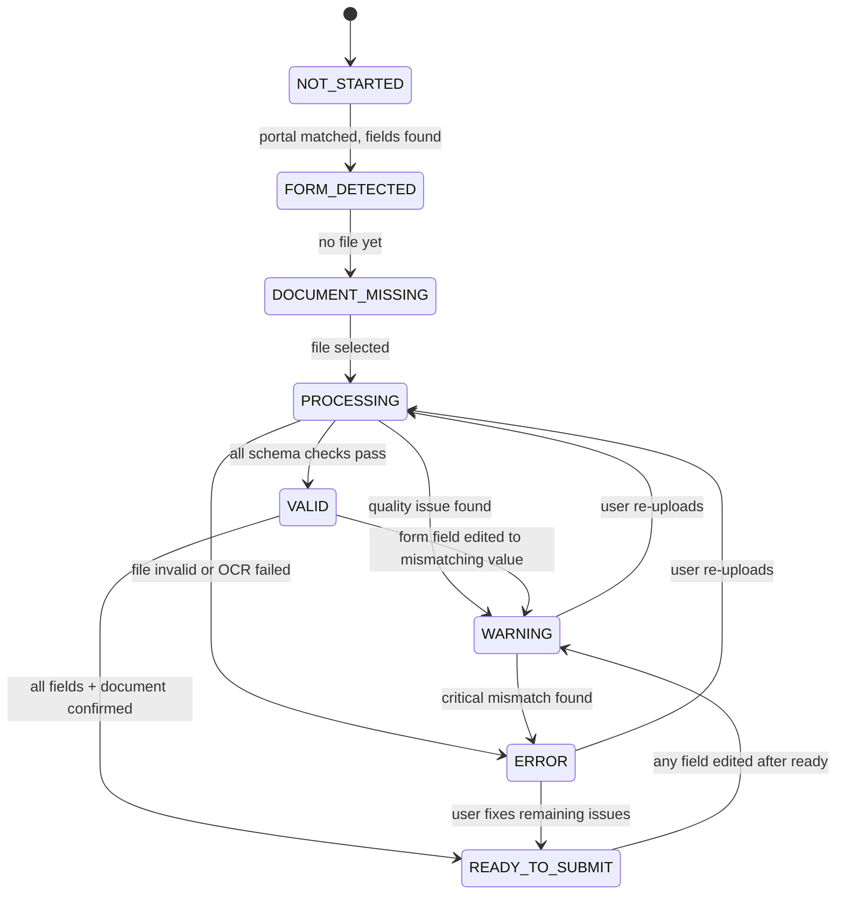

# Pre-Submission Error Guard for Official Forms
## Final Implementation-Ready PRD + Engineering Build Plan
### (SIH Prototype)

**Version:** 2.0 (Final)
**Status:** Implementation-ready
**Intended audience:** Engineering team and AI coding assistants (e.g., Claude Code, Antigravity) implementing this project phase-by-phase, starting from nothing

---

## 1. Executive Summary

Pre-Submission Error Guard is a browser extension prototype (built for Smart India Hackathon) that catches clerical and document errors before a user submits an official form — a scholarship application, government certificate request, or similar. It compares what the user typed into the form against what OCR reads from their uploaded supporting document, and checks the document itself for format, size, and scan-quality problems, all inside the browser.

The prototype is built **bottom-to-top** across 16 phases (Phase 0–15), starting with a self-built mock portal and a bare extension shell, and only reaching OCR, cross-verification, and submit blocking after every earlier layer is independently proven. The initial build is deliberately backend-free: React + Vite for the mock portal, Manifest V3 + vanilla JS for the extension, and PDF.js + OpenCV.js + Tesseract.js for all document processing, running entirely client-side. Real government portal integration (Phase 14) and further generalization (Phase 15) are explicitly deferred until the mock-portal MVP passes full end-to-end testing.

## 2. Problem Statement

Applicants filling official online forms make small, avoidable mistakes — a name or DOB that doesn't match the certificate they're attaching, the wrong document entirely, or a blurry/cropped/oversized scan. Most portals validate file format and size at best; almost none check whether the *content* of an uploaded document agrees with what was typed into the form. These mismatches typically surface only after submission, during manual verification, costing the applicant time they may not have before a deadline.

There is no lightweight, portal-agnostic browser tool that catches these errors at the moment they're made, using only information already visible in the browser — no backend integration with the target portal, no bypassing of its own validation.

## 3. Product Vision

A browser extension that acts as a "spell checker for government forms": it reads the form, reads the uploaded document via OCR, and tells the user — before they click Submit — whether the two agree and whether the document is fit to submit. It starts as a controlled, self-contained prototype (mock portal + client-side extension, no backend) and is architected so that swapping in a real government portal later is a configuration exercise, not a rewrite. It never claims to guarantee government approval — only that a transparent, defined set of pre-submission checks has passed.

## 4. Goals

1. Build a controlled mock "Scholarship Application" portal to develop and test against, before touching any real government site.
2. Build a Manifest V3 browser extension that activates on the mock portal and, later, on a real portal via configuration only.
3. Read form field values (Name, DOB, Certificate Number) in real time.
4. Detect uploaded files and validate format, size, and basic corruption client-side.
5. Analyze document image quality (blur, resolution, brightness, contrast, cropping) using OpenCV.js.
6. Extract structured fields from documents using Tesseract.js OCR, with explicit confidence and failure handling.
7. Cross-verify OCR-extracted fields against form values using field-appropriate, schema-driven comparison strategies.
8. Support multiple document types (Income/Community/Residence Certificate) through JSON schema configuration, without rewriting the validation engine.
9. Re-validate reactively and efficiently as the user edits the form or replaces the document.
10. Present clear inline and popup UI feedback, and block submission when critical errors remain.
11. Keep the initial prototype fully client-side — no backend, no cloud storage, no external document transmission.
12. Prove the architecture is portable to a real government portal via configuration alone (Phase 14), only after the mock-portal MVP is fully tested.

## 5. Non-Goals

- The extension does not access, modify, bypass, or interact with any target portal's backend validation or submission logic — it only reads the DOM and file inputs already visible in the user's own browser.
- The extension does not guarantee government/institutional approval of a submission; it is a pre-submission sanity check only.
- The initial prototype does not target any real government portal — Phase 0–13 work entirely against a self-built mock portal.
- The system does not use AI to automatically classify the uploaded document's type — the user explicitly selects it, and that selection alone determines the active schema.
- The system does not apply the same comparison strategy to every field — matching is field-specific (fuzzy for names, strict for identifiers, none for dates beyond exact normalized comparison).
- The initial prototype does not use a backend, database, authentication server, or cloud storage of any kind.
- The extension does not permanently store uploaded documents or OCR output beyond the active validation session.

## 6. Target Users

- **Students** applying for scholarships or certificate-backed applications online.
- **Citizens** applying for government certificates or welfare-scheme benefits.
- **Common Service Center (CSC) operators / cyber cafe assistants** filling forms on behalf of others.
- **Hackathon evaluators / stakeholders** assessing the prototype's feasibility as a pre-submission safety layer for e-governance portals.

## 7. User Stories

1. As a student, I want to be warned if my typed DOB doesn't match my uploaded certificate, so I can fix it before submitting.
2. As a user, I want to be told immediately if my scan is too blurry to be trusted, so I can re-scan it.
3. As a user, I want to select the document type I'm uploading so only the relevant fields are checked.
4. As a user, I want one clear "READY TO SUBMIT" signal once everything checks out.
5. As a user, I want the Submit button itself to stop me if something is still wrong.
6. As a developer, I want to add a new document type by writing a JSON schema, not by editing the validation engine.
7. As a developer, I want to point the extension at a new portal by writing a new portal configuration, not by rewriting the extension.
8. As a privacy-conscious user, I want my documents processed in my own browser, never uploaded anywhere.

## 8. Functional Requirements

- FR1: A mock scholarship-application portal shall exist with stable, extension-friendly selectors for Name, DOB, Certificate Number, Document Type, Upload, and Submit.
- FR2: The extension shall activate only on configured/matched portal URLs (mock portal first; real portal later via new config).
- FR3: The extension shall read configured form fields and track value changes in real time.
- FR4: The extension shall detect file selection on the configured upload input.
- FR5: The extension shall validate file format, MIME/signature, size, and basic readability before any further processing.
- FR6: The extension shall analyze accepted documents for blur, resolution, brightness, contrast, and likely cropping using OpenCV.js.
- FR7: The extension shall run OCR via Tesseract.js on quality-passed documents and extract only the fields defined by the active schema.
- FR8: OCR results shall include confidence; low-confidence fields shall be marked NEEDS_REVIEW, never silently treated as MATCH or MISMATCH.
- FR9: The user shall explicitly select a document type; this selection alone determines the active JSON validation schema.
- FR10: The validation engine shall compare only schema-defined fields, using the schema-defined strategy per field (fuzzy / exact-date / exact-string).
- FR11: A form-field change shall re-run only that field's comparison, without re-running OCR.
- FR12: A document change shall re-run the full pipeline (file validation → quality → OCR → extraction → all comparisons) and shall not let stale/superseded results overwrite newer ones.
- FR13: The extension shall present field-level and document-level status inline in the page and a summary in the popup.
- FR14: The extension shall intercept the Submit action, run a final validation check, and block submission if critical errors remain, otherwise allow the native submission unmodified.
- FR15: Adding a new document type shall require only a new JSON schema file; adding a new portal shall require only a new portal configuration file.

## 9. Non-Functional Requirements

- **No backend in the initial prototype:** all processing (file validation, quality analysis, OCR, comparison) runs client-side in the extension/browser.
- **Performance:** field-level comparisons complete within ~200ms of a (debounced) form change; the full document pipeline (quality + OCR) should complete within a few seconds for a typical scanned image on a mid-range laptop, with a visible PROCESSING state throughout.
- **Reliability:** any pipeline failure (quality-analysis error, OCR error/timeout) must degrade to an explicit warning/error state, never a silent pass.
- **Portability:** Manifest V3, Chrome/Edge compatible; portal-specific details live entirely in JSON configuration, never inline in engine code.
- **Privacy:** no document content or OCR text ever leaves the browser in the initial prototype (there is no backend to send it to); nothing is persisted beyond the active tab session.
- **Testability:** every phase has independent unit/component tests (Vitest) and, from Phase 2 onward, browser-level tests (Playwright) against the mock portal.

## 10. Product Flow



## 11. Detailed System Flow



## 12. Technology Stack

The prototype uses exactly this stack — no backend, no unnecessary dependencies:

| Layer | Technology | Notes |
|---|---|---|
| Mock Portal | React + Vite + JavaScript | Self-built, stable selectors, no styling framework required beyond plain CSS/optional Tailwind |
| Browser Extension shell | Manifest V3, JavaScript | Content Script, Background Service Worker, Popup |
| Extension UI | React, JavaScript, CSS (Tailwind optional if it speeds up work) | In-page injected UI + popup dashboard |
| File handling | Browser File APIs, JavaScript | Metadata, size, MIME, signature checks |
| PDF processing | **PDF.js** | Render PDF pages to canvas for quality analysis and OCR input |
| Image processing | **OpenCV.js** | Blur/sharpness, resolution, brightness, contrast, cropping heuristics; OCR preprocessing (grayscale, threshold, denoise, deskew) |
| OCR | **Tesseract.js** | Runs entirely in-browser; provides raw text + confidence where supported |
| Validation engine | JavaScript (deterministic, modular, schema-parameterized) | No ML/AI in the comparison logic itself |
| Validation schemas | **JSON** | One file per document type |
| Portal configuration | JSON | One file per portal (mock first, real government portal later) |
| State management | Centralized plain JS state initially; **Zustand** only if complexity genuinely requires it | Avoid premature complexity |
| Unit/component testing | **Vitest** | Normalizers, comparison strategies, schema loading, file validation |
| End-to-end testing | **Playwright** | Full browser flows against the mock portal |
| Backend | **None in the initial prototype** | Explicitly excluded — see Section 5 and Section 21 |
| Version control | Git + GitHub | Standard branch-per-phase or trunk-based, developer's choice |

No FastAPI, Node backend, database, authentication server, or cloud document storage is introduced in Phases 0–13. A backend may only be considered in Phase 14+ if browser-side OCR/image processing proves insufficient for a real portal's document quality/volume — and even then, it is an explicit, separately justified decision, not a default.

## 13. Architecture



All document processing (PDF.js, OpenCV.js, Tesseract.js, the Validation Engine) runs inside the extension's execution context (content script or an offscreen document, per Manifest V3 constraints for heavier WASM workloads) — there is no network call to any backend in the initial prototype.

## 14. Portal Configuration

```json
{
  "portalId": "demo-scholarship-portal",
  "matchUrls": ["http://localhost:5173/apply"],
  "fields": [
    { "logicalName": "name", "selector": "#applicant-name", "type": "text" },
    { "logicalName": "dob", "selector": "#applicant-dob", "type": "date" },
    { "logicalName": "certificateNumber", "selector": "#cert-number", "type": "text" }
  ],
  "documentUpload": { "selector": "#upload-certificate", "logicalName": "certificateFile" },
  "documentTypeSelector": "#document-type",
  "submitSelector": "#submit-application"
}
```

Exact selector values are finalized when the mock portal (Phase 0) is implemented, but the *shape* of this configuration is fixed now, so the Form/File Detectors are written against it rather than against hardcoded selectors. This is also the exact artifact that gets replaced (not the engine) when moving to a real government portal in Phase 14.

## 15. File Validation

Checks run before any image/OCR processing, entirely client-side:

- File signature (magic bytes), not just filename extension.
- Allowed formats per schema's `fileRules.allowedFormats` (MVP: PDF, JPG, PNG).
- Size limit per schema's `fileRules.maxSizeMB` (MVP: 2MB).
- Basic open/parse check (PDF.js can open the PDF and report at least one page; image decodes without error).

```text
❌ Expected PDF/JPG/PNG.
❌ Maximum size is 2 MB. Selected file is 4.2 MB.
❌ File could not be opened and may be corrupted.
```

A hard file-validation failure stops the pipeline before quality analysis or OCR runs.

## 16. Document Quality Analysis

Using OpenCV.js on the rendered image (or PDF.js-rendered first page):

- **Blur/sharpness** — variance-of-Laplacian style metric against a threshold.
- **Resolution** — minimum pixel dimensions.
- **Brightness/Contrast** — histogram-based checks for too dark/bright/washed-out.
- **Cropping** — edge/border heuristic to catch documents cut off at the page boundary.

Output: per-metric value, overall pass/warning, and human-readable reasons. A quality failure normally stops the pipeline before OCR, since OCR on a bad scan is unreliable and would produce confusing low-confidence results indistinguishable from an OCR-engine limitation.

## 17. OCR Pipeline (Tesseract.js)



- **Input:** quality-passed document, preprocessed via OpenCV.js (grayscale, threshold/binarize, denoise, deskew where practical).
- **Processing:** Tesseract.js runs entirely in the browser (WASM), returning recognized text with confidence data where the API exposes it.
- **Output:** raw text, then schema-scoped structured fields with per-field confidence.
- **Confidence:** each extracted field carries a confidence value; below threshold → `NEEDS_REVIEW`, never silently promoted to MATCH/MISMATCH.
- **Failure handling:** Tesseract.js errors, timeouts, or near-empty output produce an explicit OCR-failure state; the pipeline never guesses.
- **Low-quality documents never reach OCR** — they're stopped at Section 16's gate.

## 18. Field Extraction

Same approach as the general design: label-anchored heuristics plus format-specific regex, scoped strictly to the active schema's `extract` list.

- **Name** — near a "Name"/"Applicant Name" label, or the most prominent title-cased line.
- **DOB** — regex over common date formats, anchored near a "DOB"/"Date of Birth" label.
- **Certificate Number** — regex matching the configured pattern, anchored near a "Certificate No" label.
- **Address** — text block following an "Address" label (looser normalization).

Only fields in the active schema's `extract` array are ever attempted.

## 19. Validation Schemas

```json
{
  "documentType": "incomeCertificate",
  "displayName": "Income Certificate",
  "extract": ["name", "dob", "certificateNumber"],
  "compare": [
    { "field": "name", "strategy": "fuzzyNormalized", "threshold": 0.85 },
    { "field": "dob", "strategy": "exactNormalizedDate" },
    { "field": "certificateNumber", "strategy": "exactNormalizedString" }
  ],
  "fileRules": { "allowedFormats": ["pdf", "jpg", "png"], "maxSizeMB": 2 },
  "qualityRules": { "minResolutionPx": 800, "maxBlurScore": 0.4 }
}
```

```json
{
  "documentType": "communityCertificate",
  "displayName": "Community Certificate",
  "extract": ["name", "certificateNumber"],
  "compare": [
    { "field": "name", "strategy": "fuzzyNormalized", "threshold": 0.85 },
    { "field": "certificateNumber", "strategy": "exactNormalizedString" }
  ]
}
```

```json
{
  "documentType": "residenceCertificate",
  "displayName": "Residence Certificate",
  "extract": ["name", "address"],
  "compare": [
    { "field": "name", "strategy": "fuzzyNormalized", "threshold": 0.85 },
    { "field": "address", "strategy": "fuzzyNormalized", "threshold": 0.7 }
  ]
}
```

A **Schema Registry** loads these JSON files and exposes them by `documentType`. Adding a fourth document type means adding a fifth JSON file — the Validation Engine's code does not change.

## 20. Cross-Verification (Comparison Logic)



- **Name:** lowercase, trim, collapse whitespace, strip honorifics → fuzzy similarity (e.g., token-based/Levenshtein) at a configurable threshold, to absorb minor OCR noise.
- **DOB:** parse both sides to canonical `YYYY-MM-DD` → exact comparison only. No fuzzy matching — a date error is a real, meaningful mismatch.
- **Certificate Number:** normalize case/whitespace/configured punctuation (e.g., hyphens) → exact comparison only. Identifiers must not accept near-matches.
- **Address:** normalize whitespace/case → looser fuzzy threshold, since legitimate formatting varies more.

Possible per-field results: `MATCH`, `MISMATCH`, `NEEDS_REVIEW`, `PENDING`. Low OCR confidence always yields `NEEDS_REVIEW` regardless of the raw string comparison outcome.

## 21. Real-Time Validation



- Form-field changes are debounced (~300–500ms) and re-run only that field's comparison against the last known OCR extraction — never a re-OCR.
- Document changes cancel any in-flight pipeline run and re-run the full pipeline; a generation/run-token prevents a stale, superseded result from overwriting the state for a newer document.
- Document-type changes reload the schema and re-evaluate against the existing document (if any) without re-running OCR, unless the document itself also changed.

## 22. UI/UX

- **Field indicators:** ✓ Match / ❌ Mismatch / ⚠ Needs review / ⏳ Processing, next to each configured field.
- **Document status:** `PROCESSING` / `WARNING` / `ERROR` / `VALID`, near the upload control.
- **Overall status banner:** `NOT_STARTED → FORM_DETECTED → DOCUMENT_MISSING → PROCESSING → WARNING/ERROR → VALID → READY_TO_SUBMIT`.
- **Mismatch panels:** always show the entered value next to the value found in the document, plus a suggested next action.
- **Popup dashboard:** document type, overall status, and a checklist of every schema-defined check with its current state.

## 23. Submit Guard



The Submit Guard never modifies the portal's submission request or backend behavior — it only decides whether to call `preventDefault()`. It re-attaches correctly if the portal re-renders the Submit button.

## 24. Application State Model



## 25. Data Models

```typescript
interface FormFieldValue {
  logicalName: string;
  value: string;
  type: "text" | "date" | "number";
  lastUpdated: number;
}

interface UploadedDocument {
  documentType: string;
  file: { name: string; mimeType: string; sizeBytes: number };
  fileValidation: { passed: boolean; reasons: string[] };
  quality: { blurScore: number; resolutionOk: boolean; brightnessOk: boolean; croppingOk: boolean; passed: boolean; reasons: string[] };
  ocr: {
    status: "not_run" | "processing" | "succeeded" | "failed";
    extractedFields: Record<string, { value: string; confidence: number }>;
  };
}

interface FieldComparisonResult {
  field: string;
  strategy: "exactNormalizedDate" | "exactNormalizedString" | "fuzzyNormalized";
  formValue: string;
  documentValue: string | null;
  result: "MATCH" | "MISMATCH" | "NEEDS_REVIEW" | "PENDING";
  reason?: string;
}

interface ValidationSchema {
  documentType: string;
  displayName: string;
  extract: string[];
  compare: { field: string; strategy: string; threshold?: number }[];
  fileRules: { allowedFormats: string[]; maxSizeMB: number };
  qualityRules?: { minResolutionPx: number; maxBlurScore: number };
}

interface PortalConfig {
  portalId: string;
  matchUrls: string[];
  fields: { logicalName: string; selector: string; type: "text" | "date" | "number" }[];
  documentUpload: { selector: string; logicalName: string };
  documentTypeSelector: string;
  submitSelector: string;
}

interface ValidationState {
  appState: "NOT_STARTED" | "FORM_DETECTED" | "DOCUMENT_MISSING" | "PROCESSING" | "WARNING" | "ERROR" | "VALID" | "READY_TO_SUBMIT";
  activeSchema: ValidationSchema | null;
  formFields: Record<string, FormFieldValue>;
  document: UploadedDocument | null;
  comparisons: FieldComparisonResult[];
}
```

## 26. Privacy and Security

- No backend exists in the initial prototype, so no document or OCR text ever leaves the browser — this is the strongest possible privacy posture for Phases 0–13.
- Uploaded files and OCR output live only in in-memory state for the active tab session; nothing is written to `localStorage`/persistent extension storage by default.
- No document content or OCR text is logged, even in development builds outside of an explicit, temporary dev-mode console log.
- No cloud storage, authentication server, or third-party transmission is introduced.
- When Phase 14 (real portal) or a future backend is considered, this section must be revisited and re-approved before any document data is allowed to leave the browser.

## 27. Error Handling

| Failure point | Handling |
|---|---|
| Form selector not found (mock or real portal) | Log a configuration warning; treat field as absent, don't crash the content script |
| File fails format/size/signature validation | Report specific reason; skip quality/OCR |
| OpenCV.js quality check throws (e.g., unsupported image) | Report as quality WARNING with "could not analyze," not a silent pass |
| Tesseract.js errors or times out | Explicit OCR-failure state; no `extractedFields` populated; comparisons show `PENDING` |
| OCR confidence below threshold for a field | `NEEDS_REVIEW`, never auto-MATCH or auto-MISMATCH |
| Portal DOM changes break selectors | Lightweight activation self-check reports "could not fully activate," never partial/incorrect validation |
| Rapid file replacement | Run-token/generation counter discards stale in-flight results |

## 28. MVP Scope

**In scope (Phases 0–13):**
- Mock Scholarship Application portal (React + Vite).
- Extension activation, form reading, file detection/validation, quality analysis, OCR, and cross-verification for Income Certificate (Name, DOB, Certificate Number).
- Real-time reactive re-validation.
- Full in-page + popup UI.
- Submit Guard blocking/allowing based on validation state.
- Community Certificate and Residence Certificate schemas proven through the same engine (Phase 8 onward), exercised fully by Phase 13's end-to-end suite.
- Full client-side stack: React/Vite, Manifest V3, PDF.js, OpenCV.js, Tesseract.js, JSON schemas, Vitest, Playwright. No backend.

**Explicitly out of scope until Phase 14+:**
- Any real government portal.
- Any backend service.
- Multi-page document handling.
- Non-Latin-script OCR tuning.
- Automatic document-type classification.

## 29. Testing Strategy

- **Vitest unit tests:** field normalizers, comparison strategies, schema loading, file-validation rules, portal-config parsing.
- **Vitest component tests:** Form Detector against a static DOM fixture of the mock portal; File Detector against synthetic `File` objects; Quality Analyzer against a labeled set of good/blurry/cropped sample images (mocking or directly exercising OpenCV.js).
- **Integration tests:** full document pipeline (file → quality → OCR → extraction) against a small fixed set of real fixture documents with known-correct expected extractions.
- **Playwright end-to-end tests:** run against the mock portal (`localhost`), covering the happy path to READY_TO_SUBMIT and each individual failure mode (wrong format, oversized file, blurry scan, name/DOB/certificate-number mismatch), plus Submit Guard blocking/allowing behavior.
- **Regression fixture set:** a small, versioned folder of sample documents (good and bad variants), reused across phases.

## 30. System Acceptance Criteria

- The extension activates only on configured/matched portals (mock portal first).
- All configured form fields are read correctly and update in real time.
- File format/size/corruption issues are always caught before quality analysis or OCR run.
- Quality issues are always caught before OCR runs on a document unlikely to OCR well.
- OCR failures and low-confidence extractions are never presented as a false MATCH.
- Only schema-defined fields are ever extracted or compared for a given document type.
- Editing a field after reaching READY_TO_SUBMIT correctly reverts state and re-validates.
- Clicking Submit with unresolved critical errors never reaches the mock portal's native submission handler.
- Clicking Submit with all checks passed reaches the native submission unmodified.
- Adding Community Certificate and Residence Certificate schemas requires zero changes to the Validation Engine's code.
- The entire MVP (Phases 0–13) runs with zero backend calls.

## 31. Development Milestones

1. **M0 — Mock Portal Live:** Phase 0 complete; portal runs locally with stable selectors.
2. **M1 — Extension Shell:** Phase 1 complete.
3. **M2 — Extension Sees the Portal:** Phase 2 complete.
4. **M3 — Form Awareness:** Phase 3 complete.
5. **M4 — Document Awareness:** Phases 4–5 complete.
6. **M5 — OCR Online:** Phase 6 complete against fixtures.
7. **M6 — First End-to-End Match:** Phase 7 complete — the core value proposition proven for one schema.
8. **M7 — Generalized Engine:** Phases 8–9 complete.
9. **M8 — Reactive System:** Phase 10 complete.
10. **M9 — User-Facing MVP:** Phases 11–12 complete.
11. **M10 — MVP Sign-off:** Phase 13 complete; full end-to-end suite passes, zero backend calls.
12. **M11 — Real Portal Compatibility Proven:** Phase 14 complete.
13. **M12 — Generalized Beyond MVP:** Phase 15 complete.

## 32. Risks and Mitigations

| Risk | Mitigation |
|---|---|
| Tesseract.js accuracy/speed insufficient in-browser | Gate OCR behind OpenCV.js quality checks; treat low confidence as a first-class UI state; only reconsider a backend if this genuinely fails at the real-portal stage (Phase 14+) |
| Manifest V3 restrictions complicate running heavy WASM (OpenCV.js/Tesseract.js) in a content script | Use a Manifest V3 offscreen document or the background service worker for heavy processing, keeping the content script itself lightweight |
| Mock portal selectors drift from what a real portal looks like, giving false confidence | Keep portal configuration fully external from day one (Section 14) so Phase 14 is a genuine, representative test of the architecture, not a special case |
| Real government portal DOM is far messier than the mock portal | Treat Phase 14 explicitly as a "compatibility test" (Section 34) with its own investigation tasks, not a drop-in reuse |
| Over-fitting the engine to Income Certificate only | Require Community/Residence Certificate schemas to work end-to-end (Phase 13) before declaring the MVP done |
| Scope creep toward real portal integration before mock MVP is solid | Hard phase gate: Phase 14 cannot start before Phase 13's acceptance criteria are all met |

---

# ENGINEERING BUILD PLAN

Mandatory order: Phase 0 → Phase 15. Each phase must be completed and tested before the next begins.

## Phase 0 — Mock Scholarship Application Portal

**Objective:** Build a simple, stable, self-contained scholarship-application web page to develop and test the extension against.

**Why now:** Nothing else can be built or reliably tested without a controlled environment with stable selectors.

**Features:** React + Vite app with Full Name, DOB, Certificate Number, Document Type dropdown (default: Income Certificate), Upload Certificate file input, Submit Application button. The form must work correctly with no extension installed.

**Technical components:** React, Vite, plain CSS.

**Inputs:** None (net-new build).

**Outputs:** A running local web app (e.g., `localhost:5173/apply`) with stable element IDs.

**Dependencies:** None.

**Exact tasks:**
1. Scaffold a Vite + React project.
2. Build the form with stable, memorable `id` attributes for every field, the upload input, the document-type dropdown, and the submit button (these IDs become the Phase-2 portal configuration).
3. Implement a plain client-side `onSubmit` handler (e.g., show a "Submitted!" message) — no real backend needed for the mock portal itself.
4. Seed the document-type dropdown with Income Certificate, Community Certificate, Residence Certificate options.
5. Prepare a small set of test values (correct Name/DOB/CertNo, plus deliberately incorrect variants) for manual use in later phases.

**Acceptance criteria:** The form renders, accepts input in all fields, accepts a file upload, and submits successfully with no extension installed. All required elements have stable IDs.

**Manual test cases:**
1. Fill all fields with valid values and submit → confirm success behavior with no extension.
2. Upload a file and confirm the file name displays.
3. Change the document-type dropdown and confirm the selection persists.

**Expected result:** A working, minimal mock portal ready to be targeted by the extension.

**What should NOT be implemented yet:** Any extension code; any validation logic; any OCR or file-quality checks — the mock portal itself performs none of these.

---

## Phase 1 — Basic Browser Extension

**Objective:** Get a Manifest V3 extension installed and running, independent of any specific portal.

**Why now:** Establishes the extension shell before it needs to know about any page content.

**Features:** manifest.json, background service worker, minimal content script, minimal popup.

**Technical components:** Manifest V3 config, Background Service Worker, Content Script, Popup.

**Inputs:** None.

**Outputs:** An installable extension that logs activation.

**Dependencies:** None (can be built in parallel with Phase 0, but integration — Phase 2 — requires both).

**Exact tasks:**
1. Scaffold manifest.json (`manifest_version: 3`, `activeTab`, `scripting` permissions).
2. Implement a content script that logs "content script loaded" and messages the background worker.
3. Implement a background service worker that logs receipt of that message.
4. Implement a minimal popup showing a static "Extension loaded" message.

**Acceptance criteria:** Extension loads via "load unpacked" with no errors; console shows content-script and background logs on any page.

**Manual test cases:** Load extension → open any webpage → confirm console logs appear; open popup → confirm it renders.

**Expected result:** A working, portal-agnostic extension shell.

**What should NOT be implemented yet:** Any portal matching, form reading, or file handling.

---

## Phase 2 — Connect Extension to Mock Portal

**Objective:** Make the extension recognize and activate specifically on the mock portal, using the portal-configuration shape defined in Section 14.

**Why now:** Bridges the two independently-built pieces (Phases 0 and 1) before any real functionality is added.

**Features:** Portal configuration file for the mock portal; URL matching; activation indicator reflecting a real match.

**Technical components:** Portal configuration loader, URL-match logic in the content script/manifest.

**Inputs:** The mock portal's actual URL and element IDs (from Phase 0).

**Outputs:** "Active" state specifically on the mock portal, "Inactive" elsewhere.

**Dependencies:** Phases 0 and 1.

**Exact tasks:**
1. Write the mock portal's config JSON (`matchUrls`, field selectors, upload selector, document-type selector, submit selector) using the real IDs from Phase 0.
2. Update the manifest's content-script `matches` (or a runtime check) to the mock portal's URL.
3. On activation, resolve every selector in the config against the DOM and log which ones were found vs. missing.
4. Update the popup to show "Active on demo-scholarship-portal" vs. "Inactive."

**Acceptance criteria:** Extension shows Active only on the mock portal; all configured selectors resolve successfully; a deliberately broken selector is logged as missing, not silently ignored.

**Manual test cases:**
1. Open the mock portal → confirm Active + all selectors resolved.
2. Open any other page → confirm Inactive.
3. Temporarily rename one field's `id` in the mock portal → confirm that field is logged as missing, others still resolve.

**Expected result:** The extension is now correctly and exclusively bound to the mock portal via configuration.

**What should NOT be implemented yet:** Reading field values, file detection, any validation.

---

## Phase 3 — Read Form Data

**Objective:** Read and track the mock portal's Name/DOB/Certificate Number fields in real time.

**Why now:** Establishes reliable form-state tracking, the first of the two inputs to later comparisons.

**Features:** Form Detector reading initial values and reacting to changes.

**Technical components:** Form Detector, in-memory `formFields` state.

**Inputs:** DOM of the mock portal (via Phase 2's resolved selectors).

**Outputs:** `{ name, dob, certificateNumber }`, updated on change.

**Dependencies:** Phase 2.

**Exact tasks:**
1. On activation, read each configured field's current `.value` into state.
2. Attach `input`/`change` listeners; update state and log diffs on every change.
3. Surface the live form-state object in the popup for visual confirmation during development.

**Acceptance criteria:** All three fields read correctly on load; edits update state immediately; a missing field logs a warning, not a crash.

**Manual test cases:**
1. Pre-fill the form, reload the page → confirm initial state is correct.
2. Type a new DOB → confirm state updates.
3. Clear the Name field → confirm state reflects empty string.

**Expected result:** A reliable, real-time mirror of form state.

**What should NOT be implemented yet:** File handling, OCR, comparisons.

---

## Phase 4 — File Detection + Validation

**Objective:** Detect uploaded files and validate format/size/corruption, client-side, before any image analysis.

**Why now:** Establishes the second data input (documents) and its cheapest gate, independent of quality/OCR.

**Features:** File Detector on the mock portal's upload input; File Validator (format, MIME/signature, size, basic readability).

**Technical components:** File Detector, File Validator (plain JS + browser File APIs).

**Inputs:** `File` object from the upload input.

**Outputs:** `{ passed: boolean, reasons: string[] }`.

**Dependencies:** Phase 2 (independent of Phase 3).

**Exact tasks:**
1. Attach a `change` listener to the configured upload input.
2. Read file metadata and first bytes for signature verification on selection.
3. Implement format/size checks against the Income Certificate schema's `fileRules` (PDF/JPG/PNG, 2MB).
4. Attempt a basic open/parse check (image decode, or PDF.js `getDocument` succeeding with ≥1 page — this is also where PDF.js first gets wired in).
5. Log/display the validation result.

**Acceptance criteria:** Valid file passes; wrong format is rejected with a specific reason; oversized file is rejected citing both limit and actual size; a corrupted file is rejected as unreadable.

**Manual test cases:**
1. Upload a valid PDF under 2MB → expect pass.
2. Upload a JPG renamed `.pdf` → expect format/signature rejection.
3. Upload a 4.2MB file → expect size rejection with both numbers shown.
4. Upload a truncated/corrupted PDF → expect corruption rejection.

**Expected result:** Fast, deterministic gatekeeping before any expensive processing; PDF.js integrated for basic PDF opening.

**What should NOT be implemented yet:** OpenCV.js quality analysis, OCR, comparisons.

---

## Phase 5 — Document Quality Analysis

**Objective:** Assess whether an accepted file is good enough to OCR reliably, using OpenCV.js.

**Why now:** Prevents wasted OCR effort on unreadable scans; gives feedback before OCR runs.

**Features:** Quality Analyzer: blur, resolution, brightness/contrast, cropping.

**Technical components:** OpenCV.js, PDF.js (to rasterize PDF pages for analysis).

**Inputs:** File that passed Phase 4.

**Outputs:** `{ blurScore, resolutionOk, brightnessOk, croppingOk, passed, reasons[] }`.

**Dependencies:** Phase 4.

**Exact tasks:**
1. Render the image (or PDF.js-rendered first page) to a canvas.
2. Load the canvas into an OpenCV.js `Mat`; compute a Laplacian-variance sharpness score against a threshold.
3. Check pixel dimensions against a minimum-resolution threshold.
4. Compute brightness/contrast via histogram analysis; flag too-dark/too-bright/washed-out.
5. Apply a basic edge/border heuristic to flag likely cropping.
6. Aggregate into pass/fail plus itemized reasons.

**Acceptance criteria:** A clear, well-lit, uncropped sample passes all checks; a blurred sample is flagged as blurry only; a downscaled sample is flagged low-resolution only; a cropped sample is flagged as likely cropped only.

**Manual test cases:**
1. Upload the "good" reference sample → all quality checks pass.
2. Upload a Gaussian-blurred version → blur flag only.
3. Upload a downscaled (~300px-wide) version → resolution flag only.
4. Upload a version with one edge cropped → cropping flag only.

**Expected result:** A reliable pre-OCR quality gate, with OpenCV.js proven end-to-end on real sample images.

**What should NOT be implemented yet:** OCR, field extraction, comparisons.

---

## Phase 6 — OCR

**Objective:** Extract raw text (and later structured fields) from documents that pass Phases 4–5, using Tesseract.js.

**Why now:** OCR is the highest-risk component; it must be proven independently, against known fixtures, before any comparison logic depends on it.

**Features:** Tesseract.js integration; OpenCV.js preprocessing (grayscale, threshold, denoise, deskew); confidence capture; explicit failure handling.

**Technical components:** Tesseract.js, OpenCV.js (preprocessing), PDF.js (page source).

**Inputs:** Quality-passed document.

**Outputs:** Raw OCR text + confidence data.

**Dependencies:** Phase 5.

**Exact tasks:**
1. Implement OpenCV.js preprocessing ahead of the OCR call (grayscale, threshold/binarize, denoise, deskew where practical).
2. Integrate Tesseract.js and run it against the fixture Income Certificate sample.
3. Capture and expose confidence data alongside raw text.
4. Implement explicit failure/timeout handling — never return partial results silently as if complete.
5. Restrict raw-OCR-text logging to a local dev-mode flag only (privacy requirement, Section 26).

**Acceptance criteria:** OCR correctly transcribes the fixture's visible text with reasonable accuracy; confidence varies meaningfully between clean and noisy regions; a forced engine failure produces an explicit failure state, not empty-but-"successful" output.

**Manual test cases:**
1. Run OCR on the "good" fixture → inspect raw text for correctness.
2. Force-run OCR on a previously-blurred sample (bypassing the Phase 5 gate for this test only) → expect low confidence, not a crash.
3. Simulate a Tesseract.js error/timeout → expect an explicit OCR-failure state.

**Expected result:** Raw OCR capability proven independently of extraction/comparison logic.

**What should NOT be implemented yet:** Schema-aware field extraction, cross-verification, multiple document types.

---

## Phase 7 — Fixed Cross-Verification

**Objective:** Prove form ↔ document agreement works for exactly one hardcoded schema (Income Certificate).

**Why now:** This is the core value proposition; proving it once with fixed fields isolates the hardest problem before generalization.

**Features:** Hardcoded Field Extractor for Name/DOB/Certificate Number; Comparison Engine with the three field-specific strategies; per-field MATCH/MISMATCH/NEEDS_REVIEW reporting.

**Technical components:** Field Extractor (fixed), Field Normalizer, Comparison Engine (plain JS).

**Inputs:** Form state (Phase 3) + OCR raw text (Phase 6).

**Outputs:** Three `FieldComparisonResult` objects.

**Dependencies:** Phases 3 and 6.

**Exact tasks:**
1. Implement label-anchored extraction for the three fields from the fixture's OCR text.
2. Implement normalizers: name (case/whitespace/honorifics), DOB (parse to ISO date), certificate number (case/whitespace/hyphen strip).
3. Implement comparison strategies: fuzzy similarity for name, exact for DOB and certificate number.
4. Wire form values and extracted document values into the Comparison Engine.
5. Handle low OCR confidence: mark that field `NEEDS_REVIEW` regardless of the raw string comparison outcome.

**Acceptance criteria:** Matching pair → 3x MATCH; wrong DOB → DOB MISMATCH only; wrong certificate number → that field's MISMATCH only; trivial name formatting difference → still MATCH (fuzzy tolerance); forced low confidence on a field → NEEDS_REVIEW.

**Manual test cases:**
1. Fill form matching the fixture exactly → 3x MATCH.
2. Change only form DOB → DOB MISMATCH, others unaffected.
3. Change only form certificate number → that field's MISMATCH only.
4. Introduce a trivial name formatting difference → MATCH.
5. Force low confidence on certificate number → NEEDS_REVIEW.

**Expected result:** The central value proposition works end-to-end for one fixed case.

**What should NOT be implemented yet:** Schema registry/generalization, document-type selector UI wiring, additional document types.

---

## Phase 8 — Generalized Validation Schemas

**Objective:** Generalize Phase 7's hardcoded logic into a reusable, JSON-schema-driven engine.

**Why now:** Only generalize once the single-case version is proven correct.

**Features:** Schema Registry loading JSON schema files; Field Extractor and Comparison Engine refactored to be schema-parameterized.

**Technical components:** Schema Registry, generalized Field Extractor, generalized Comparison Engine.

**Inputs:** Income/Community/Residence Certificate schema JSON files + form/OCR data.

**Outputs:** Same `FieldComparisonResult[]` shape, now driven by whichever schema is active.

**Dependencies:** Phase 7.

**Exact tasks:**
1. Write the three schema JSON files (Section 19).
2. Implement the Registry to load and expose schemas by `documentType`.
3. Refactor the Field Extractor to take `schema.extract` as a parameter.
4. Refactor the Comparison Engine to take `schema.compare` as a parameter.
5. Re-run all Phase 7 manual test cases against the refactored engine using the Income Certificate schema to confirm no regression.

**Acceptance criteria:** Income Certificate through the generalized engine matches Phase 7 results exactly; Community Certificate correctly ignores DOB entirely; Residence Certificate correctly uses the looser address threshold; a throwaway fourth test schema works without engine code changes.

**Manual test cases:**
1. Re-run Phase 7's five cases against the generalized engine → identical results.
2. Load Community Certificate schema with a fixture → confirm DOB untouched.
3. Load Residence Certificate schema with a slightly reworded address → confirm fuzzy match passes at the looser threshold.
4. Add a throwaway fourth schema and confirm it works with zero engine changes.

**Expected result:** One validation engine, provably reusable across document types via configuration alone.

**What should NOT be implemented yet:** User-facing document-type selection UI, real-time reactivity, Submit Guard.

---

## Phase 9 — User Document-Type Selection

**Objective:** Wire the mock portal's document-type dropdown to the Schema Registry.

**Why now:** Exposes the proven schema-driven engine (Phase 8) through the actual user control.

**Features:** Document-type selector detection; selection handler loading the corresponding schema and resetting pipeline state.

**Technical components:** Portal config's `documentTypeSelector`, selection-to-schema wiring.

**Inputs:** User's dropdown selection on the mock portal.

**Outputs:** Active schema reference in Validation State.

**Dependencies:** Phase 8.

**Exact tasks:**
1. Listen for change events on the mock portal's document-type dropdown.
2. Map the selected option to a `documentType` key and load the corresponding schema from the Registry.
3. On change, reset any prior document/OCR/comparison state and, if a document is already uploaded, re-run the pipeline against the new schema.

**Acceptance criteria:** Selecting Income Certificate loads that schema and (with a file present) extracts/compares its three fields; switching to Community Certificate mid-session drops the DOB comparison and re-evaluates the remaining two; no AI-based classification occurs anywhere in this flow.

**Manual test cases:**
1. Select Income Certificate, upload the fixture → 3-field validation as in Phase 8.
2. Without changing the document, switch to Community Certificate → DOB check disappears, other two re-evaluate.
3. Select a document type before uploading → `DOCUMENT_MISSING` state, no extraction attempted.

**Expected result:** Document-type selection genuinely drives which checks run.

**What should NOT be implemented yet:** Full real-time dependency optimization (Phase 10), polished UI (Phase 11), Submit Guard (Phase 12).

---

## Phase 10 — Real-Time Validation

**Objective:** Make the system reactive and efficient — only re-run what's actually affected by a given change.

**Why now:** A UX/efficiency layer on top of an already-correct pipeline; adding it earlier would complicate debugging Phases 7–9.

**Features:** Dependency-aware re-validation; debouncing; cancelable/supersedable pipeline runs.

**Technical components:** Validation State Manager's dependency logic, debounce utility, run-generation token.

**Inputs:** Change events from Form Detector, File Detector, document-type selector.

**Outputs:** Minimally-scoped re-validation runs.

**Dependencies:** Phase 9.

**Exact tasks:**
1. Debounce form text-field change handlers (~300–500ms).
2. On a form-field change, re-run only that field's comparison against the last OCR extraction — no re-OCR.
3. On a document change, cancel any in-flight run for the previous file, then run the full pipeline for the new file.
4. On a schema change, re-run comparisons against the existing extraction without re-OCR (unless the document also changed).
5. Add a run-generation counter so a slow, superseded OCR call can't overwrite newer state.

**Acceptance criteria:** Editing a field only triggers that field's comparison (verified via instrumentation); rapidly replacing the file twice results in only the second/latest file's results being reflected; fast typing doesn't trigger a run per keystroke.

**Manual test cases:**
1. From a matched state, edit only DOB → confirm only DOB comparison re-ran.
2. Replace the file twice in quick succession → confirm final state reflects only the last file.
3. Type a name quickly → confirm validation fires only after typing pauses.

**Expected result:** An efficient, race-condition-free reactive pipeline.

**What should NOT be implemented yet:** Final UI polish (Phase 11), Submit Guard (Phase 12).

---

## Phase 11 — Error/Success UI

**Objective:** Build the in-page and popup UI users will actually see.

**Why now:** UI should present state that's already correct and reactive — building it earlier risks polishing an unreliable pipeline.

**Features:** Field-level badges; inline error/warning panels; document-level status badge; popup dashboard with overall status banner.

**Technical components:** In-Page UI (React), Popup UI (React), shared rendering layer subscribing to Validation State.

**Inputs:** `ValidationState`.

**Outputs:** Rendered UI reflecting current state.

**Dependencies:** Phase 10.

**Exact tasks:**
1. Implement field-level badge components (✓/❌/⚠/⏳) injected next to each configured field.
2. Implement inline panels showing entered-value-vs-document-value plus a suggested action.
3. Implement the document-level status badge near the upload control.
4. Implement the popup dashboard listing every schema-defined check plus the overall status banner.
5. Wire all components to re-render on Validation State changes (already efficiently scoped by Phase 10).

**Acceptance criteria:** Every state in Section 24 has a distinct, correct visual representation; mismatch panels always show both values; popup and in-page indicators never disagree.

**Manual test cases:**
1. Walk the happy path → confirm banner progresses through the correct state sequence.
2. Force a DOB mismatch → confirm the panel shows both values and a corrective suggestion.
3. Force a quality warning → confirm the document badge and popup agree.

**Expected result:** A UI that accurately reflects the already-correct underlying state.

**What should NOT be implemented yet:** Submit Guard enforcement (Phase 12).

---

## Phase 12 — Submit Guard

**Objective:** Intercept the mock portal's Submit action and block it when critical errors remain.

**Why now:** Final enforcement mechanism; depends on every prior layer being correct.

**Features:** Submit event interception; final validation pass; block-with-summary vs. allow-passthrough.

**Technical components:** Submit Guard, final-check hook into Validation State Manager.

**Inputs:** Submit button click on the mock portal.

**Outputs:** Either a blocked submission with an issue summary, or an unmodified pass-through.

**Dependencies:** Phase 11.

**Exact tasks:**
1. Attach a capture-phase listener to the mock portal's submit button/form.
2. On click, read the latest full validation state across all schema-defined checks.
3. If any check is in `ERROR` (or configured-as-blocking `WARNING`) state, call `preventDefault()` and render a consolidated issue summary.
4. If all checks are `VALID`/`READY_TO_SUBMIT`, allow the event to proceed unmodified.
5. Ensure the guard re-attaches correctly if React re-renders the submit button.

**Acceptance criteria:** Submit with an unresolved critical issue never triggers the mock portal's native submit handler; Submit with all checks passed triggers it exactly as with no extension installed; the summary lists every remaining issue, not just the first.

**Manual test cases:**
1. With a known DOB mismatch, click Submit → confirm no native submission fires; summary names the DOB issue.
2. Resolve all issues, reach READY_TO_SUBMIT, click Submit → confirm native submission fires.
3. Introduce two simultaneous issues → confirm both are listed.

**Expected result:** A reliable final gate consistent with the UI. This completes the MVP feature set.

**What should NOT be implemented yet:** Additional document types beyond what Phase 8 already defined; real portal work (Phase 14).

---

## Phase 13 — Complete End-to-End MVP Testing

**Objective:** Validate the complete MVP as a single system against the mock portal.

**Why now:** Confirms all twelve prior phases compose correctly together and that the MVP is genuinely backend-free and complete before any real-portal work begins.

**Features:** None (testing/hardening only).

**Technical components:** Playwright end-to-end suite, Vitest regression suite, finalized fixture set.

**Inputs:** The complete MVP extension + mock portal + fixture documents.

**Outputs:** A pass/fail report against Section 30's acceptance criteria.

**Dependencies:** Phase 12.

**Exact tasks:**
1. Finalize the regression fixture set (good, blurry, cropped, wrong-format, wrong-size, name/DOB/certificate-number-mismatch variants) for all three document types.
2. Write Playwright tests covering the happy path and each failure mode for Income Certificate, plus at least one full run each for Community and Residence Certificate.
3. Run the full manual test list from Phases 0–12 in one continuous session to catch cross-phase regressions.
4. Fix discovered issues; do not add new features during this phase.
5. Explicitly verify zero network calls to any backend occur during the entire flow (e.g., via browser dev tools network tab).
6. Sign off against every criterion in Section 30.

**Acceptance criteria:** All Section 30 criteria pass on the mock portal with the finalized fixture set, across all three schemas, with zero backend calls.

**Manual test cases:** The full aggregated list from Phases 0–12, run back-to-back, plus explicit checks for state transitions across phase boundaries.

**Expected result:** A verified, fully working, backend-free MVP.

**What should NOT be implemented yet:** Any real portal integration — that is Phase 14.

---

## Phase 14 — Real Government Portal Integration

**Objective:** Prove the architecture is portable to a real government (or similar official) portal, via configuration alone.

**Why now:** Only after the mock-portal MVP is fully tested (Phase 13) does the plan permit touching a real target, per the mandatory phase order.

**Features:** New portal configuration for a real target; any newly-discovered comparison/extraction adjustments (kept in configuration or, if truly necessary, minimal engine extensions — not portal-specific hacks).

**Technical components:** Same Form Detector, File Detector, Validation Engine, Submit Guard — exercised against new configuration; a new portal config JSON.

**Inputs:** A real (or realistic staging) government/official portal.

**Outputs:** A working portal configuration + confirmation that the existing engine required no portal-specific code changes.

**Dependencies:** Phase 13.

**Exact tasks:**
1. Inspect the target portal's DOM to identify form fields, file upload component(s), document-type selection (if present), and submit behavior.
2. Determine whether the portal exposes a document-type selector; if not, decide how the schema is selected (e.g., a single fixed schema for that specific form, or an extension-side selector as a substitute — document this decision explicitly).
3. Write a new portal configuration JSON mapping the real portal's selectors to logical field names.
4. Activate the extension against the real portal using only this new configuration; do not modify the Form Detector, File Detector, Validation Engine, or Submit Guard code.
5. Run the fixture-based tests against real (or realistic) documents for whatever certificate type the target form requires.
6. Document any genuine architectural gaps discovered (e.g., a new comparison strategy needed for an unfamiliar field type) as follow-up work — do not silently special-case the engine for this one portal.
7. If browser-side OCR/quality analysis proves insufficient at this scale (e.g., due to document complexity or performance), formally evaluate introducing a backend as a scoped, separate decision — not a default.

**Acceptance criteria:** The extension activates on the real portal and runs the full pipeline using only the new configuration; zero changes were required to the Validation Engine, Field Extractor core, or Submit Guard code; any gaps found are documented rather than hacked around.

**Manual test cases:**
1. Full happy-path run on the real portal with a valid matching document.
2. At least one deliberate mismatch case (e.g., DOB) on the real portal.
3. At least one file/quality failure case on the real portal.

**Expected result:** Confirmation that the mock-portal architecture generalizes to a real target — the central architectural bet behind building the mock portal first.

**What should NOT be implemented yet:** Broad multi-portal generalization beyond this one real portal — that is Phase 15.

---

## Phase 15 — Generalization to More Portals and Documents

**Objective:** Extend the now-twice-proven system (mock + one real portal) to additional document types and portals as a repeatable, configuration-driven process.

**Why now:** Only after both the mock-portal MVP (Phase 13) and a real-portal compatibility test (Phase 14) succeed does broader generalization make sense.

**Features:** Additional document-type schemas as needed by new portals; additional portal configurations; a documented runbook for adding either.

**Technical components:** Same as before, exercised against new configuration only.

**Inputs:** New schema JSON files, new portal configuration files, new fixture documents.

**Outputs:** A system supporting N document types and M portals via configuration.

**Dependencies:** Phase 14.

**Exact tasks:**
1. Add and validate any further document-type schemas required by new target portals.
2. Add and validate additional portal configurations.
3. Expand the regression fixture set and Playwright suite to cover all supported document types/portals.
4. Write a short runbook documenting the process for adding a new document type or portal, for future contributors.
5. Re-run the full regression suite across every supported portal/document-type combination to confirm no cross-portal regressions.

**Acceptance criteria:** Each newly added portal/document type works end-to-end using only configuration; the full regression suite passes across all supported combinations simultaneously.

**Manual test cases:** One full happy-path and one failure-mode run per newly added portal/document-type combination; a full regression re-run of all previously supported combinations.

**Expected result:** A configuration-driven system proven across multiple real-world-relevant portals and document types, without having compromised the correctness established in Phases 0–14.

**What should NOT be implemented yet:** Any feature from Section 5's non-goals (backend-by-default, AI-based document classification, etc.) remain permanently out of scope unless a future, separately-justified PRD revision says otherwise.

---

*End of document.*
